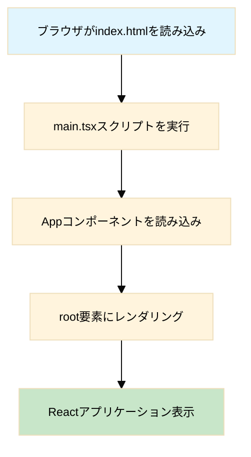
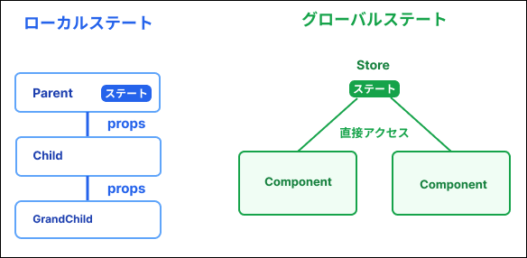

## 参考、ツールなど

- 参考Gitリポジトリ
https://github.com/kurushiba/notion-clone-ui

- React + Typescriptで超本格的なNotionクローンを作ろうQAボット
https://notebooklm.google.com/notebook/bbdcdcf8-c5c6-4d6b-ab10-e6831ddd7cd4

- VSCode プラグイン
    - ES7+ React/Redux/React-Native snippets
    https://marketplace.visualstudio.com/items?itemName=dsznajder.es7-react-js-snippets
    - Auto Close Tag
    https://marketplace.visualstudio.com/items?itemName=formulahendry.auto-close-tag

- diffchecker
https://www.diffchecker.com/

- ネーミングツール
https://codic.jp/

- DeepL 翻訳
https://www.deepl.com/ja/translator


## 講座概要

- React Typescript Supabaseを使用した開発
- 基本的なCRUD 検索 リアルタイム通信
- Jotaiを使用したグローバル状態管理

## 備忘メモ

### <a href="./docs/named-or-default-export.md">名前付きエクスポート、デフォルトエクスポート</a>

### `index.html` と `src/main.tsx` の **Vite + React + TypeScriptの標準的な構成**

### React Router

React Routerは、Reactアプリケーションでページ遷移（ルーティング）を実装するための公式ライブラリです。

**URLとコンポーネントの紐付け
→リロードせずにURLの変更、表示内容の切り替え**

使用ファイル
<a href="./src/App.tsx">App.tsx</a>

```js
  return (
    <BrowserRouter>
      <div className="h-full">
        <Routes>
          <Route path="/" element={<Layout />}>
            <Route index element={<Home />} />
            <Route path="/notes/:id" element={<NoteDetail />} />
          </Route>
          <Route path="signin" element={<SignIn />} />
          <Route path="signup" element={<SignUp />} />
        </Routes>
      </div>
    </BrowserRouter>
  )
```

**\<Route>**
パスとコンポーネントを紐づける
```js
<Route path="パス" element={<コンポーネント />} />
```

**\<Routes>**
\<Routes>は複数の\<Route>を囲む親要素
\<Routes>は現在のURLに最も一致する1つのRouteだけを表示します。

### グローバルステートとローカルステートの違い

ローカルステートはプロップスの数が増え、複雑になってしまう欠点がある
↓
グローバルステートで解決（ローカルコンポーネントから外に出すイメージ）




## 手順

- tsconfig.app.jsonを修正

- tailwind.config.jsを作成。

- vite.config.tsの修正

- リアクトルーターをインストール
```
npm install react-router-dom react-textarea-autosize
```

```
npm install @supabase/supabase-js@2.47.7
```

- Supabaseのセットアップ
プロジェクト作成

- Supabaseのライブラリのインストール
```
npm install @supabase/supabase-js
```
https://supabase.com/docs/reference/javascript/installing

- Supabaseの初期化
  - Web管理画面のコンソールでSign In / Providers
  - <a href="./src/lib/supabase.ts">supabase.ts</a>を作成

- ユーザー登録APIをコーディング<a href="./src/modules/auth/auth.repository.ts">auth.repository.ts</a>
- ユーザー登録APIをコンポーネントから呼び出す処理をコーディング<a href="./src/pages/Signup.tsx">Signup.tsx</a>
- 質問 async await
- ログインAPIをコーディング<a href="./src/modules/auth/auth.repository.ts">auth.repository.ts</a>

- ログインAPIをコンポーネントから呼び出す処理をコーディング<a href="./src/pages/Signin.tsx">Signin.tsx</a>

- ログイン情報をグローバールステートに


---

## React + TypeScript + Vite

This template provides a minimal setup to get React working in Vite with HMR and some ESLint rules.

Currently, two official plugins are available:

- [@vitejs/plugin-react](https://github.com/vitejs/vite-plugin-react/blob/main/packages/plugin-react) uses [Babel](https://babeljs.io/) for Fast Refresh
- [@vitejs/plugin-react-swc](https://github.com/vitejs/vite-plugin-react/blob/main/packages/plugin-react-swc) uses [SWC](https://swc.rs/) for Fast Refresh

### Expanding the ESLint configuration

If you are developing a production application, we recommend updating the configuration to enable type-aware lint rules:

```js
export default tseslint.config([
  globalIgnores(['dist']),
  {
    files: ['**/*.{ts,tsx}'],
    extends: [
      // Other configs...

      // Remove tseslint.configs.recommended and replace with this
      ...tseslint.configs.recommendedTypeChecked,
      // Alternatively, use this for stricter rules
      ...tseslint.configs.strictTypeChecked,
      // Optionally, add this for stylistic rules
      ...tseslint.configs.stylisticTypeChecked,

      // Other configs...
    ],
    languageOptions: {
      parserOptions: {
        project: ['./tsconfig.node.json', './tsconfig.app.json'],
        tsconfigRootDir: import.meta.dirname,
      },
      // other options...
    },
  },
])
```

You can also install [eslint-plugin-react-x](https://github.com/Rel1cx/eslint-react/tree/main/packages/plugins/eslint-plugin-react-x) and [eslint-plugin-react-dom](https://github.com/Rel1cx/eslint-react/tree/main/packages/plugins/eslint-plugin-react-dom) for React-specific lint rules:

```js
// eslint.config.js
import reactX from 'eslint-plugin-react-x'
import reactDom from 'eslint-plugin-react-dom'

export default tseslint.config([
  globalIgnores(['dist']),
  {
    files: ['**/*.{ts,tsx}'],
    extends: [
      // Other configs...
      // Enable lint rules for React
      reactX.configs['recommended-typescript'],
      // Enable lint rules for React DOM
      reactDom.configs.recommended,
    ],
    languageOptions: {
      parserOptions: {
        project: ['./tsconfig.node.json', './tsconfig.app.json'],
        tsconfigRootDir: import.meta.dirname,
      },
      // other options...
    },
  },
])
```