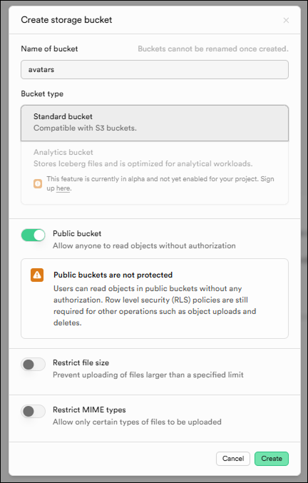

## 参考、ツールなど

- 参考Gitリポジトリ
https://github.com/kurushiba/notion-clone-ui

- React + Typescriptで超本格的なNotionクローンを作ろうQAボット
https://notebooklm.google.com/notebook/bbdcdcf8-c5c6-4d6b-ab10-e6831ddd7cd4

- VSCode プラグイン
    - ES7+ React/Redux/React-Native snippets
    https://marketplace.visualstudio.com/items?itemName=dsznajder.es7-react-js-snippets
    - Auto Close Tag
    https://marketplace.visualstudio.com/items?itemName=formulahendry.auto-close-tag

- diffchecker
https://www.diffchecker.com/

- ネーミングツール
https://codic.jp/

- DeepL 翻訳
https://www.deepl.com/ja/translator


## 講座概要

- React Typescript Supabaseを使用した開発
- 基本的なCRUD 検索 リアルタイム通信
- Jotaiを使用したグローバル状態管理

## 備忘メモ

### <a href="./docs/named-or-default-export.md">名前付きエクスポート、デフォルトエクスポート</a>

### `index.html` と `src/main.tsx` の **Vite + React + TypeScriptの標準的な構成**

### React Router

React Routerは、Reactアプリケーションでページ遷移（ルーティング）を実装するための公式ライブラリです。

**URLとコンポーネントの紐付け
→リロードせずにURLの変更、表示内容の切り替え**

使用ファイル
<a href="./src/App.tsx">App.tsx</a>

```js
  return (
    <BrowserRouter>
      <div className="h-full">
        <Routes>
          <Route path="/" element={<Layout />}>
            <Route index element={<Home />} />
            <Route path="/notes/:id" element={<NoteDetail />} />
          </Route>
          <Route path="signin" element={<SignIn />} />
          <Route path="signup" element={<SignUp />} />
        </Routes>
      </div>
    </BrowserRouter>
  )
```

**\<Route>**
パスとコンポーネントを紐づける
```js
<Route path="パス" element={<コンポーネント />} />
```

**\<Routes>**
\<Routes>は複数の\<Route>を囲む親要素
\<Routes>は現在のURLに最も一致する1つのRouteだけを表示します。

### グローバルステートとローカルステートの違い

ローカルステートはプロップスの数が増え、複雑になってしまう欠点がある
↓
グローバルステートで解決（ローカルコンポーネントから外に出すイメージ）


#### Jotaiの使い方

<a href="./src/modules/notes/note.state.ts">note.state.ts</a>

**useStateとの違い**

| 項目 | `useState` | `useAtom` |
|------|------------|-----------|
| **スコープ** | コンポーネント内のみ | アプリケーション全体 |
| **共有** | 親子間でpropsで渡す | どこからでも直接アクセス |
| **状態の定義** | コンポーネント内 | 外部で定義可能 |
| **依存関係** | コンポーネントのライフサイクル<br />コンポーネントと一緒に破棄 | 独立 |


### GitHub Pagesデプロイ手順

1. `.github/workflows/deploy.yml`を作成済み
2. Settings → Pages → Source を「GitHub Actions」に設定
3. GitHub Secrets に`VITE_SUPABASE_URL`と`VITE_SUPABASE_API_KEY`を登録
4. `main`または`dev`ブランチにpushすると自動デプロイ
5. デプロイURL: https://idw-coder.github.io/react-notion/

## 手順

- tsconfig.app.jsonを修正

- tailwind.config.jsを作成。

- vite.config.tsの修正

11. リアクトルーターをインストール
```
npm install react-router-dom react-textarea-autosize
```

```
npm install @supabase/supabase-js@2.47.7
```

13. Supabaseのセットアップ
プロジェクト作成

- Supabaseのライブラリのインストール
```
npm install @supabase/supabase-js
```
https://supabase.com/docs/reference/javascript/installing

15. Supabaseの初期化
  - Web管理画面のコンソールでSign In / Providers
  - <a href="./src/lib/supabase.ts">supabase.ts</a>を作成

16. ユーザー登録APIをコーディング<a href="./src/modules/auth/auth.repository.ts">auth.repository.ts</a>

17. ユーザー登録APIをコンポーネントから呼び出す処理をコーディング<a href="./src/pages/Signup.tsx">Signup.tsx</a>

- 質問 async await

18. ログインAPIをコーディング<a href="./src/modules/auth/auth.repository.ts">auth.repository.ts</a>

19. ログインAPIをコンポーネントから呼び出す処理をコーディング<a href="./src/pages/Signin.tsx">Signin.tsx</a>

20. ログイン情報をグローバールステートに
  - Jotaiライブラリを導入
```
npm install jotai
```
21. <a href="src\modules\auth\current-user.state.ts">current-user.state.ts
</a>にAtomを定義してグローバルステートを使用できるように

- ユーザー登録時にログイン情報をグローバルステートに追加する処理をコーディング src\Layout.tsx src\pages\Signup.tsx src\pages\Signin.tsx

- src\modules\auth\auth.repository.ts セッションから現在のユーザーにログイン情報を取得してsrc\App.tsxにわたす

38. src\modules\notes\note.repository.tsに特定のIDノートを取得する処理をコーディング

39. src\pages\NoteDetail.tsx components\TitleInput.tsxにノートのタイトルを表示

40. src\components\TitleInput.tsx src\modules\notes\note.repository.ts タイトル更新できるように

41. src\components\TitleInput.tsx src\modules\notes\note.repository.ts タイトル更新できるように

- 質問 SQL全然使用したことないですが、学習優先度は高いですか？MySQL PostgreSQL

42. BlockNoteインストール
```
npm install @blocknote/core @blocknote/react @blocknote/mantine
```
43. BlockNoteの設定

44. BlockNoteの本文更新処理

45. ノートの詳細ページの遷移をコーディング

46. 検索モーダルの表示

49. Debounce（検索の処理で都度実行されないように）
```
npm install use-debounce
```

50. 検索結果からノート詳細へ遷移

52. 子ノートも削除するSQLをSupabaseに登録

```sql
create or replace function delete_children_notes_recursively(note_id INTEGER)
returns setof notes
language sql
as $$
  WITH RECURSIVE r AS (
        SELECT * FROM notes WHERE id = $1
      UNION ALL
        SELECT notes.* FROM notes, r WHERE notes.parent_document = r.id
  )
  DELETE FROM notes WHERE id IN (SELECT id FROM r) RETURNING *;
$$;
```

53. グローバルステートの削除

54. Supabaseのリアルタイム通信の設定
- Supabaseウェブコンソール画面ダッシュボードメニューから
Database→Tables→Edit table→Enable Realtimeにチェックを入れてsave

- SQL Editorに下記のコードを張り付け実行

```sql
ALTER TABLE notes REPLICA IDENTITY FULL
```

55. リアルタイム通信処理コール


ブラウザで2タブで開き削除した際もう一方のタブで下記エラー
```
Uncaught Error: Too many re-renders. React limits the number of renders to prevent an infinite loop.
```

## ユーザープロフィール機能

1. Supabaseにprofilesテーブルを作成
Supabase のダッシュボードで以下のSQL

```sql
-- プロフィールテーブル作成
CREATE TABLE profiles (
  id UUID REFERENCES auth.users(id) PRIMARY KEY,
  avatar_url TEXT,
  created_at TIMESTAMP WITH TIME ZONE DEFAULT NOW(),
  updated_at TIMESTAMP WITH TIME ZONE DEFAULT NOW()
);

-- RLS（Row Level Security）を有効化
ALTER TABLE profiles ENABLE ROW LEVEL SECURITY;

-- 自分のプロフィールは読める
CREATE POLICY "Users can view own profile"
  ON profiles FOR SELECT
  USING (auth.uid() = id);

-- 自分のプロフィールは更新できる
CREATE POLICY "Users can update own profile"
  ON profiles FOR UPDATE
  USING (auth.uid() = id);

-- 自分のプロフィールは挿入できる
CREATE POLICY "Users can insert own profile"
  ON profiles FOR INSERT
  WITH CHECK (auth.uid() = id);
```
2. Supabaseにavatarsストレージバケットを作成

Supabase ダッシュボードで以下を実行

左メニューの Storage をクリック
New bucket ボタンをクリック
以下の設定で作成

Name: avatars
Public bucket: チェックを入れる（画像を公開アクセス可能にする）


Create bucket をクリック



3. database.types.ts を更新
database.types.ts に profiles テーブルの型定義を追加

4. src/modules/profile/profile.entity.ts ファイルを作成

5. src/modules/profile/profile.repository.ts

6. pages/Profile.tsxの作成

7. App.tsx にルートを追加

8. UserItem.tsx にプロフィールリンクを追加

9. avatarsストレージバケットのポリシーを設定

```sql
-- アップロード許可（シンプル版）
CREATE POLICY "Authenticated users can upload avatars"
ON storage.objects FOR INSERT
TO authenticated
WITH CHECK (bucket_id = 'avatars');

-- 読み取り許可
CREATE POLICY "Anyone can view avatars"
ON storage.objects FOR SELECT
TO public
USING (bucket_id = 'avatars');

-- 更新許可
CREATE POLICY "Authenticated users can update avatars"
ON storage.objects FOR UPDATE
TO authenticated
USING (bucket_id = 'avatars');

-- 削除許可
CREATE POLICY "Authenticated users can delete avatars"
ON storage.objects FOR DELETE
TO authenticated
USING (bucket_id = 'avatars');
```

## コードシンタックス


パッケージをインストール
```
npm install @blocknote/code-block
```


Shikiバンドルファイルを生成
```
npx shiki-codegen --langs typescript,javascript,python,html,css --themes light-plus,dark-plus --engine javascript --precompiled ./src/shiki.bundle.ts
```


---

## React + TypeScript + Vite

This template provides a minimal setup to get React working in Vite with HMR and some ESLint rules.

Currently, two official plugins are available:

- [@vitejs/plugin-react](https://github.com/vitejs/vite-plugin-react/blob/main/packages/plugin-react) uses [Babel](https://babeljs.io/) for Fast Refresh
- [@vitejs/plugin-react-swc](https://github.com/vitejs/vite-plugin-react/blob/main/packages/plugin-react-swc) uses [SWC](https://swc.rs/) for Fast Refresh

### Expanding the ESLint configuration

If you are developing a production application, we recommend updating the configuration to enable type-aware lint rules:

```js
export default tseslint.config([
  globalIgnores(['dist']),
  {
    files: ['**/*.{ts,tsx}'],
    extends: [
      // Other configs...

      // Remove tseslint.configs.recommended and replace with this
      ...tseslint.configs.recommendedTypeChecked,
      // Alternatively, use this for stricter rules
      ...tseslint.configs.strictTypeChecked,
      // Optionally, add this for stylistic rules
      ...tseslint.configs.stylisticTypeChecked,

      // Other configs...
    ],
    languageOptions: {
      parserOptions: {
        project: ['./tsconfig.node.json', './tsconfig.app.json'],
        tsconfigRootDir: import.meta.dirname,
      },
      // other options...
    },
  },
])
```

You can also install [eslint-plugin-react-x](https://github.com/Rel1cx/eslint-react/tree/main/packages/plugins/eslint-plugin-react-x) and [eslint-plugin-react-dom](https://github.com/Rel1cx/eslint-react/tree/main/packages/plugins/eslint-plugin-react-dom) for React-specific lint rules:

```js
// eslint.config.js
import reactX from 'eslint-plugin-react-x'
import reactDom from 'eslint-plugin-react-dom'

export default tseslint.config([
  globalIgnores(['dist']),
  {
    files: ['**/*.{ts,tsx}'],
    extends: [
      // Other configs...
      // Enable lint rules for React
      reactX.configs['recommended-typescript'],
      // Enable lint rules for React DOM
      reactDom.configs.recommended,
    ],
    languageOptions: {
      parserOptions: {
        project: ['./tsconfig.node.json', './tsconfig.app.json'],
        tsconfigRootDir: import.meta.dirname,
      },
      // other options...
    },
  },
])
```