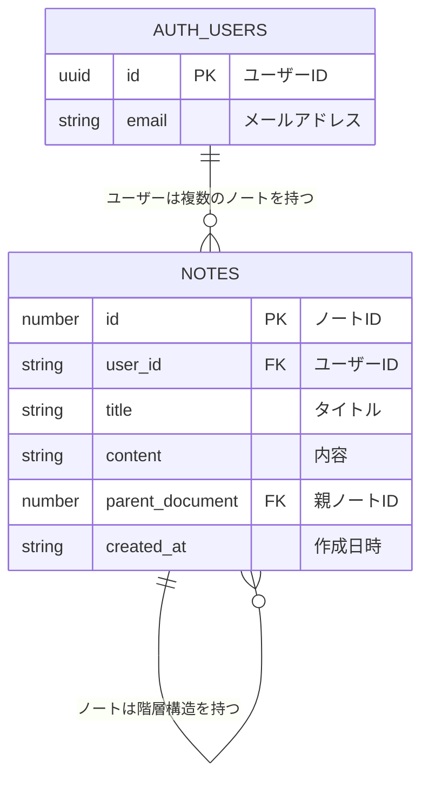

# データベース、認証について

notesテーブルのみ手動作成、auth.usersは自動生成はSupabase Authが認証を自動管理する。


## notes テーブル

| カラム名 | データ型 | 制約 | 説明 |
|---------|----------|------|------|
| id | number | PRIMARY KEY | ノートID |
| user_id | string | NOT NULL | ユーザーID |
| title | string | NULLABLE | タイトル |
| content | string | NULLABLE | 内容 |
| parent_document | number | NULLABLE | 親ノートID |
| created_at | string | NOT NULL | 作成日時 |

## Supabase Auth

ユーザー認証機能

- 一覧の確認方法
    - Supabase Dashboardにログイン
    - 左メニューの 「Authentication」 をクリック
    - 「Users」 タブを選択
    - 登録されているユーザー一覧が表示されます


## リレーション

- `notes.user_id` → `auth.users.id`
- `notes.parent_document` → `notes.id` (階層構造)





## Row Level Security

データベースの各行にセキュリティの設定が可能

何ができるかを下記の書き方で設定

```
create policy "[ポリシーの説明]"
  on [対象テーブル]
  for [対象の操作]
  to [対象のロール]
  using (
    [許可条件]
);
```

### ダッシュボードからの設定

- create policy ポリシーを新規作成