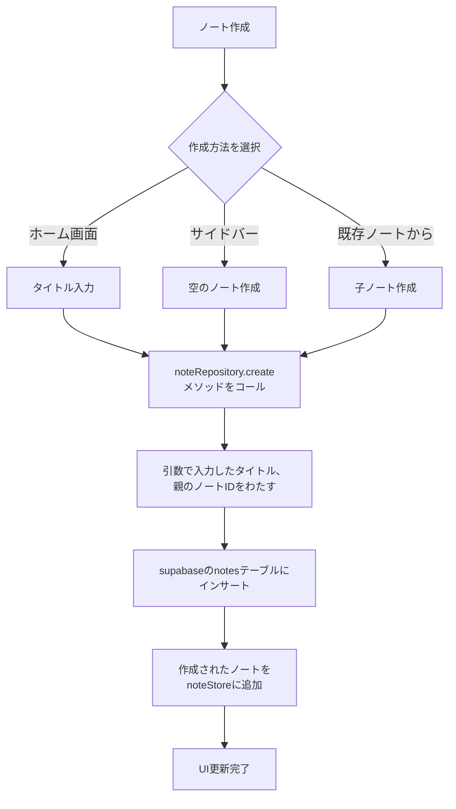
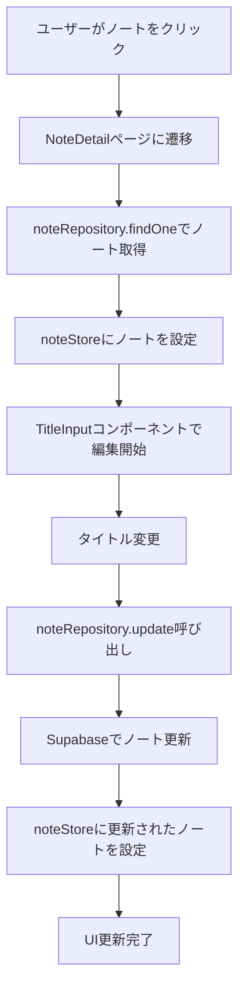
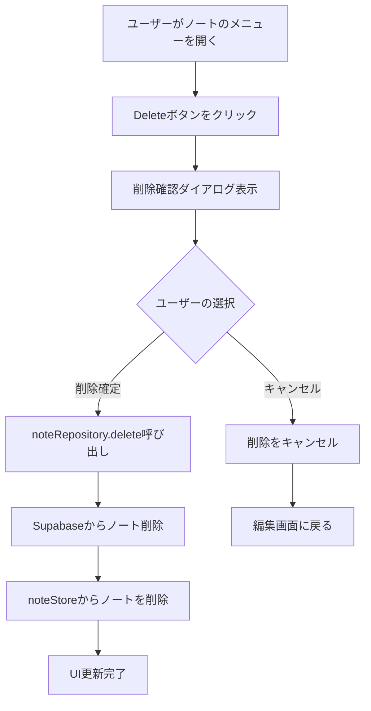
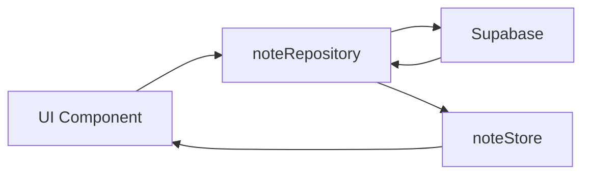

# ノート操作フロー

このドキュメントでは、React Notionアプリケーションにおけるノートの新規作成、編集、削除のフローについて説明します。

## ノート新規作成フロー

### フロー図

### 実装詳細

- **ホーム画面での作成**: `src/pages/Home.tsx`でタイトル入力と作成ボタン
- **サイドバーでの作成**: `src/components/SideBar/index.tsx`で空のノート作成
- **子ノート作成**: `src/components/NoteList/index.tsx`で既存ノートの子として作成
- **データ永続化**: `src/modules/notes/note.repository.ts`の`create`メソッド
- **状態管理**: `src/modules/notes/note.state.ts`の`set`メソッド

## ノート編集フロー

### フロー図

### 実装詳細

- **ノート詳細ページ**: `src/pages/NoteDetail.tsx`
- **タイトル編集**: `src/components/TitleInput.tsx`
- **データ更新**: `src/modules/notes/note.repository.ts`の`update`メソッド
- **状態同期**: 更新後に`noteStore.set`でグローバル状態を更新

## ノート削除フロー

### フロー図

### 実装状況

- **UI実装**: `src/components/NoteList/NoteItem.tsx`に削除メニューが実装済み
- **未実装**: `noteRepository.delete`メソッドと削除処理のロジック
- **必要な実装**:
  - `src/modules/notes/note.repository.ts`に`delete`メソッド追加
  - `src/modules/notes/note.state.ts`に`remove`メソッド追加
  - 削除確認ダイアログの実装

## 共通のアーキテクチャ

### データフロー

### 主要コンポーネント

- **noteRepository**: データベース操作の抽象化
- **noteStore**: グローバル状態管理（Jotai使用）
- **UI Components**: ユーザーインタラクションの処理

### 状態管理の特徴

- **Jotai**を使用したグローバル状態管理
- **noteStore.set**メソッドで既存ノートとの重複を自動的に処理
- リアルタイムでのUI更新を実現
